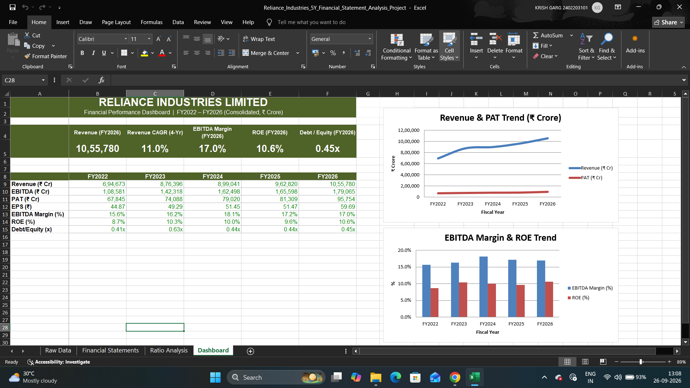
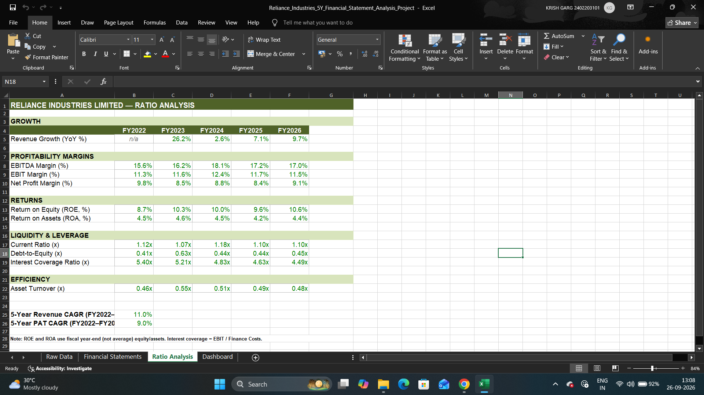

# Reliance-Industries-Financial-Statement-Analysis

A comprehensive 5-year consolidated financial statement analysis and Excel financial modelling project of Reliance Industries Limited (RIL) covering FY2022–FY2026.

The project combines a formula-driven Excel financial model, financial ratio analysis, KPI dashboard, and a 9-page analytical report to evaluate Reliance Industries' financial performance, profitability, liquidity, leverage, efficiency, and cash-flow trends.

|---|---|
| **Project Type** | Financial Analysis / Financial Modelling |
| **Company** | Reliance Industries Limited (NSE: RELIANCE) |
| **Period** | FY2022–FY2026 |
| **Currency** | ₹ Crore |
| **Tool** | Microsoft Excel |
| **Purpose** | Finance portfolio / educational project |

---

## 📌 Project Overview

This project was developed to analyse the financial performance of Reliance Industries over a five-year period using publicly available consolidated financial data.

The analysis covers:

- Income Statement, Balance Sheet & Cash Flow Statement
- Profitability, Liquidity, Leverage & Efficiency Analysis
- Financial Ratios & CAGR Analysis
- Free Cash Flow Analysis
- KPI Dashboard
- Key Financial Insights

The objective was to build a structured, formula-driven financial model and convert the numerical analysis into an analyst-style financial report.

---

## 📂 Project Files

| File | Description |
|---|---|
| `Reliance_Industries_5Y_Financial_Statement_Analysis_Project.xlsx` | Complete Excel financial model |
| `Reliance_Industries_5Y_Financial_Statement_Analysis_Report.pdf` | 9-page financial analysis report |
| `dashboard.png` | Excel dashboard preview |
| `ratio_analysis.png` | Ratio analysis preview |

---

## 📋 Key Metrics — FY2022 vs FY2026

| Metric | FY2022 | FY2026 | Trend |
|---|---|---|---|
| Revenue | ₹6,94,673 Cr | ₹10,55,780 Cr | CAGR ~11.0% |
| EBITDA Margin | 15.6% | 17.0% | +140 bps (peaked at 18.1% in FY2024) |
| PAT | ₹67,845 Cr | ₹95,754 Cr | CAGR ~9.0% |
| ROE | 8.7% | 10.6% | +190 bps |
| Debt-to-Equity | 0.41x | 0.45x | Broadly stable (spiked to 0.63x in FY2023) |
| Operating Cash Flow | ₹1,10,654 Cr | ₹1,92,113 Cr | Strong increase, outpacing PAT |
| Interest Coverage | 5.40x | 4.49x | Gradual decline — worth monitoring |

*ROE and ROA are calculated using fiscal year-end equity/assets rather than average balances. Free Cash Flow is approximated as CFO + CFI.*

---

## 🔍 Key Insights

1. **Consistent top-line growth** — Revenue increased every year during FY2022–FY2026, resulting in an ~11% CAGR, driven primarily by the scale-up of Jio Platforms and Reliance Retail alongside the O2C business.
2. **Stable operating margins** — EBITDA margin stayed within a relatively narrow 15.6%–18.1% range, peaking in FY2024 before moderating to 17.0% in FY2026.
3. **Strong cash generation** — Operating cash flow grew faster than PAT over the period, a healthy sign of underlying cash conversion. Free cash flow (CFO + CFI) turned solidly positive from FY2024 onward.
4. **Moderate, broadly stable leverage** — Debt-to-equity spiked to 0.63x in FY2023 before normalising to ~0.44x–0.45x in subsequent years.
5. **Interest coverage trend** — Declined from 5.40x to 4.49x as finance costs grew relative to EBIT — an important metric to track for a capital-intensive business.
6. **FY2023 balance sheet change** — The decline in reserves and shareholders' equity in FY2023 reflects the 2023 demerger of Jio Financial Services, a structural event rather than an operating deterioration.

---

## 📊 Excel Model Structure

The Excel workbook contains four sheets:

**1. Raw Data** — Sourced consolidated financial data: revenue, operating expenses, EBITDA, D&A, EBIT, other income, finance costs, PBT, PAT, equity, debt, assets, current assets/liabilities, and cash flows from operations, investing, and financing.

**2. Financial Statements** — Formula-driven statement calculations and derived metrics (EBITDA, EBITDA margin, EBIT, EBIT margin, net profit margin, PBT, PAT, free cash flow, balance sheet analysis). The model uses Excel formulas throughout rather than hardcoded outputs.

**3. Ratio Analysis** — Performance evaluated across:
| Category | Ratios |
|---|---|
| Profitability | EBITDA Margin, EBIT Margin, Net Profit Margin, ROE, ROA |
| Liquidity | Current Ratio |
| Leverage | Debt-to-Equity, Interest Coverage |
| Efficiency | Asset Turnover |
| Growth | Revenue Growth, CAGR |

**4. Dashboard** — KPI cards, key financial metrics, ratio summaries, multi-year trends, and financial performance indicators.

---

## 📈 Dashboard

## 📉 Ratio Analysis

---

## 🧮 Methodology

- **Financial data**: Publicly available consolidated financial statement data from Screener, StockAnalysis, and RIL annual-report data where referenced.
- **Financial period**: FY2022–FY2026, fiscal years ending 31 March.
- **Units**: All figures in ₹ Crore.
- **Formula-driven model**: Statement subtotals, margins, and ratios are calculated via Excel formulas, not hardcoded.
- **CAGR**: `(FY2026 Value / FY2022 Value)^(1/4) − 1` (four annual intervals).
- **Free Cash Flow**: Approximated as `CFO + CFI`, since a separately disclosed capex figure wasn't available at the required granularity.

---

## 🛠️ Skills Demonstrated

Financial statement analysis · Financial modelling · Microsoft Excel · Ratio analysis (profitability, liquidity, leverage, efficiency) · Cash-flow analysis · CAGR calculation · KPI & dashboard creation · Financial data interpretation · Report writing · Data visualisation · Analytical storytelling

---

## 🎯 Project Workflow

Raw Financial Data → Financial Statement Modelling → Ratio Analysis → Dashboard & Visualisation → Financial Insights → Professional PDF Report

This project demonstrates the ability to move beyond data collection into structured financial analysis using Excel.

---

## 📄 Detailed Report

A complete 9-page financial analysis report is included in the repository, covering:

1. Executive Summary
2. Income Statement Analysis
3. Profitability Analysis
4. Balance Sheet Analysis
5. Cash Flow Analysis
6. Ratio Analysis
7. Leverage & Liquidity Analysis
8. Key Insights & Conclusion
9. Limitations & Disclaimer

---

## ⚠️ Limitations & Disclaimer

- Based on publicly available financial information; figures are consolidated, in ₹ Crore, and rounded for presentation.
- Free Cash Flow is approximated as CFO + CFI.
- ROE and ROA use fiscal year-end (not average) equity and assets.
- This is a self-directed project created for educational, portfolio, and skill-demonstration purposes. It does not constitute investment advice or a recommendation to buy or sell any security, and is not a substitute for RIL's audited financial statements, annual reports, or other official disclosures.

---

## 👨‍💻 About the Project

**Created by:** Krish Garg
**Period:** FY2022–FY2026
**Primary Tool:** Microsoft Excel
**Focus:** Financial Modelling & Financial Statement Analysis

---

⭐ Feel free to explore the Excel model and financial analysis report included in this repository.
